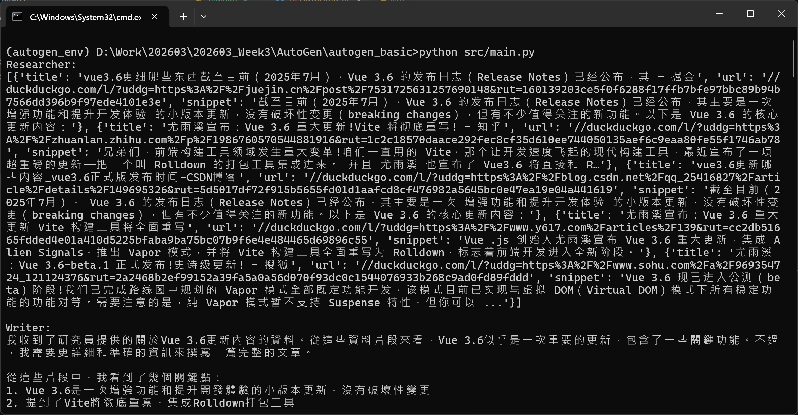

# AutoGen - AI Agent 協作範例

本專案是使用Microsoft的AutoGen(v0.7.5)開源AI Agent開發套件進行實作。建立兩位分別為不同角色AI Agent，透過協作完成使用者指定的目標任務。

## 專案重點

* 使用AutoGen建立多AI Agent，以進行協作
* 模擬不同角色分工，此專案模擬了「Researcher」與「Writer」兩角色
* 展示AI Agent間的自動對話與任務拆解過程

## 安裝說明

### 環境需求

* 需Python 3.10(含)以尚版本
* 建議建議並使用虛擬環境(venv)

### 安裝套件

安裝此專案所需的Python套件。輸入以下指令至terminal。

```
pip install -r requirements.txt
```

### 環境變數配置

建立 .env 文件，並將下方資料欄位與對應值新增至 .env 文件當中。
```
# OpenAI API Key
OPENAI_API_KEY=<your api key>
```

## 執行說明

進入cmd，並切換至對應專案目錄，並輸入以下指令。
```
python src/main.py
```

執行成功將會出現以下文字，就可輸入指派給AI Agents任務內容。
```
請輸入指派任務(輸入 'exit' 即離開): 
```

## Agent 架構說明

本專案包含兩個主要角色(AI Agent)

### 1. Researcher Agent

**負責任務理解與資料蒐集研究**
- 理解使用者的指派的任務需求
- 於網際網路上查找與整理相關資料
- 對相關資訊進行研究分析
- 提供整理後的相關內容草稿給Writer

### 2. Writer Agent

**負責內容生成與整理**
- 根據Researcher提供的資料進行寫作
- 將資料轉換為清晰、有條理的內容
- 優化語句流暢度與整體可讀性
- 將內容寫成Markdown格式
- 輸出最終結果，並儲存至使用者指定的檔案名稱與路徑

## 使用情境

使用者輸入指派任務。
```
請輸入指派任務(輸入 'exit' 即離開): 幫我整理Vue最新的測試版本Vue3.6的更新內容重點，並將內容經由整理，儲存至src資料夾中，檔名為vue3.6_.md
```

AI Agent們將會協助完成指派任務，並輸出作業過程。


完成後，將輸出使用者指定的檔案名稱之文件至指定路徑當中。
